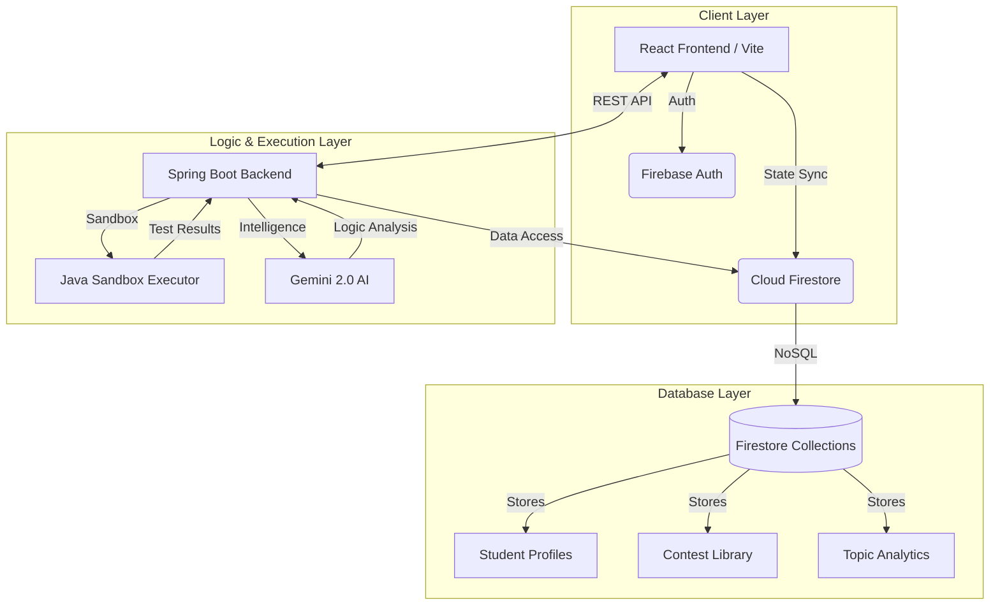

# 🎓 Study Buddy: AI-Powered Learning Ecosystem

[](https://opensource.org/licenses/MIT)
[](https://nodejs.org/)
[](https://www.oracle.com/java/)
[](https://spring.io/projects/spring-boot)
[](https://reactjs.org/)

**Study Buddy** is a sophisticated, end-to-end educational platform designed to bridge the gap between assessment and student improvement. By integrating **Google Gemini AI** and isolated **Java sandbox execution**, it provides a high-fidelity environment for automated contest evaluation, real-time feedback, and personalized learning paths.

---

## 🚀 Key Features

### For Educators & Admins
- **Automated Contest Pipeline**: Bulk upload contest definitions and student submissions via optimized JSON intake.
- **AI-Powered Evaluation**: Leverage LLM heuristics to analyze code structure, efficiency, and logic.
- **Precise Analytics**: Track "Vedam Merit Scores" and monitor eligibility for innovation/placement milestones.
- **Reporting Dashboard**: Generate comprehensive performance reports with zero manual intervention.

### For Students
- **Monaco-Powered IDE**: A premium, VS-Code style interface for solving coding challenges.
- **Smart Practice Engine**: Personalized question generation based on Topic Frequency and individual weaknesses.
- **Instant Feedback Loop**: Immediate test case results and AI-generated suggestions for optimization.
- **Progress Tracking**: Real-time visualization of skill growth across Java, Web, and Maths.

---

## 🏗️ System Architecture

Study Buddy utilizes a decoupled micro-architecture ensuring scalability and security through isolated execution layers.



---

## 🛠️ Tech Stack

| Layer | Technology | Role |
| :--- | :--- | :--- |
| **Frontend** | React 18, Vite | High-performance SPA & HMR |
| **Backend** | Spring Boot 3.2, Java 17 | Core business logic & API orchestration |
| **Execution** | Piston API / Custom Sandbox | Isolated, secure code execution |
| **Intelligence**| Google Gemini 2.0 | Automated code feedback & content generation |
| **Database** | Firebase Firestore | Real-time, distributed NoSQL storage |
| **Auth** | Firebase Auth | Domain-restricted SSO (`@vedamsot.org`) |

---

## 📋 Setup & Installation

### Prerequisites
- **Node.js** v18.x+
- **Java** 17+ (JDK)
- **Maven** 3.8+
- **Firebase Project** with Firestore and Authentication enabled

### 1. Backend Configuration
1. Navigate to the `backend` directory.
2. Create `src/main/resources/application.properties`:
   ```properties
   gemini.api.key=YOUR_GEMINI_API_KEY
   firebase.config.path=path/to/serviceAccount.json
   ```
3. Build and run:
   ```bash
   mvn clean install
   mvn spring-boot:run
   ```

### 2. Frontend Configuration
1. Navigate to the `frontend` directory.
2. Create a `.env` file based on `.env.example`:
   ```env
   VITE_FIREBASE_API_KEY=your_key
   VITE_ALLOWED_EMAIL_DOMAIN=@vedamsot.org
   ```
3. Install dependencies and start:
   ```bash
   npm install
   npm run dev
   ```

---

## 🔐 Advanced Security & Evaluation Logic

- **Sandbox Execution**: Code is executed in a restricted environment with timeout protection to prevent infinite loops and resource exhaustion.
- **Weighted Heuristics**: Final scores are calculated using a breakdown of **80% Functional Correctness** (test cases) and **20% AI Evaluation** (code quality).
- **Domain SSO**: Access is strictly limited to verified institution domains, ensuring a secure internal environment.

---

## 📈 Roadmap

- [ ] **Mobile Integration**: Native Android/iOS applications for on-the-go practice.
- [ ] **Advanced LLM Agents**: Autonomous tutoring agents that provide real-time guidance during coding sessions.
- [ ] **Collaborative Coding**: Real-time peer-to-peer collaboration in the IDE.
- [ ] **Competitive Leaderboards**: Gamified rankings based on normalized Merit Scores.

---

## 📜 License & Acknowledgments

Distributed under the **MIT License**. See `LICENSE` for more information.

Developed for the **Vedam School of Technology** to empower the next generation of engineers.
